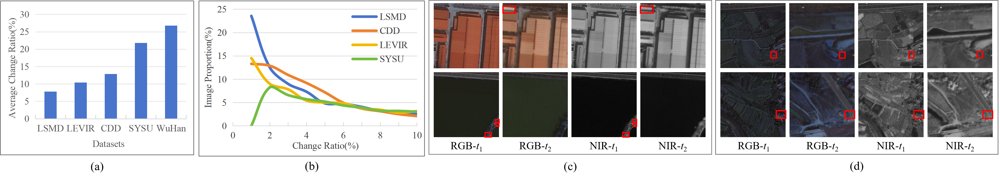

# Multi-Modal Building Change Detection for Large-Scale Small Changes: Benchmark and Baseline

This is the official implementation of the paper: 
> **Multi-Modal Building Change Detection for Large-Scale Small Changes: Benchmark and Baseline**
>
> *Ye Wang†, Wei Lu†, Zhihui You, Keyan Chen, Tongfei Liu, Kaiyu Li, Hongruixuan Chen, Qingling Shu and Sibao Chen** 

----

 

  Illustration of data distribution and challenging scenarios in realistic change detection. (a) Comparison of the average change ratio per image between the proposed LSMD and other mainstream benchmarks. (b) Comparison of image proportions across different change ratios (1%--10%) between the proposed LSMD and existing benchmarks. (c) Visual examples of small-scale changes in large-scale scenes. (d) Visual examples of small buildings under vegetation backgrounds.

 

----

  

  Abstract
  

Change detection in optical remote sensing imagery is susceptible to illumination fluctuations, seasonal changes, and variations in surface land-cover materials. Relying solely on RGB imagery often produces pseudo-changes and leads to semantic ambiguity in features. Incorporating near-infrared (NIR) information provides heterogeneous physical cues that are complementary to visible light, thereby enhancing the discriminability of building materials and tiny structures while improving detection accuracy. However, existing multi-modal datasets generally lack high-resolution and accurately registered bi-temporal imagery, and current methods often fail to fully exploit the inherent heterogeneity between these modalities. To address these issues, we introduce the Large-scale Small-change Multi-modal Dataset (LSMD), a bi-temporal RGB–NIR building change detection benchmark dataset targeting small changes in realistic scenarios, providing a rigorous testing platform for evaluating multi-modal change detection methods in complex environments. Based on LSMD, we further propose the Multi-modal Spectral Complementarity Network (MSCNet) to achieve effective cross-modal feature fusion. MSCNet comprises three key components: the Neighborhood Context Enhancement Module (NCEM) to strengthen local spatial details, the Cross-modal Alignment and Interaction Module (CAIM) to enable deep interaction between RGB and NIR features, and the Saliency-aware Multisource Refinement Module (SMRM) to progressively refine fused features. Extensive experiments demonstrate that MSCNet effectively leverages multi-modal information and consistently outperforms existing methods under multiple input configurations, validating its efficacy for fine-grained building change detection.

## Installation
+ Prerequisites for Python:
  - Creating a virtual environment in the terminal: `conda create -n LSMD python=3.8`
  - Activate the environment: `conda activate LSMD`
  - Installing necessary packages: `pip install -r requirements.txt`

+ Train/Test
  - `python -m tools.train`
  - `python -m tools.test`

## Introduction

The code will be available.

The dataset can be downloaded at [Baidu netdisk](https://pan.baidu.com/s/1t-kjJZVoxxX6zSg5SWu57Q?pwd=jddu)(Password: jddu) or [Google Drive](https://drive.google.com/file/d/1fT5fI-OQGl62Qz2eADtftifs6je1YR82/view?usp=sharing).

If you have any questions about this work, you can contact me. 

Email: [luwei_ahu@qq.com](mailto:luwei_ahu@qq.com); WeChat: luwei_ahu.

Your star is the power that keeps us updating github.

## License
Licensed under a [Creative Commons Attribution-NonCommercial 4.0 International](https://creativecommons.org/licenses/by-nc/4.0/) for Non-commercial use only.
Any commercial use should get formal permission first.

